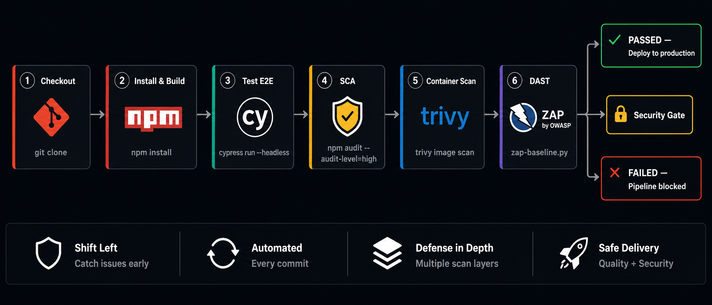

# jenkins-devsecops-pipeline

Pipeline DevSecOps completo en Jenkins con 6 etapas: desde checkout hasta Security Gate. Integra escaneos de seguridad automatizados (SCA, Trivy, OWASP ZAP) y ejecuta los tests E2E de [cypress-e2e-suite](https://github.com/JxsueMd16/cypress-e2e-suite).

---

## Pipeline

```
Checkout → Install & Build → Test E2E → SCA → Container Scan → DAST → Security Gate
```



| Etapa | Herramienta | Descripción |
|---|---|---|
| Checkout | Git | Clona el repositorio |
| Install & Build | npm | Instala dependencias |
| Test E2E | Cypress | Corre tests headless |
| SCA | npm audit | Escanea dependencias vulnerables |
| Container Scan | Trivy | Escanea imagen Docker por CVEs |
| DAST | OWASP ZAP | Escaneo dinámico de seguridad |
| Security Gate | Script | Bloquea si hay vulnerabilidades críticas |

---

## Stack


---

## Requisitos

- Jenkins con pipeline plugin
- Docker instalado en el agente
- Trivy instalado en el agente
- Node.js >= 20

---

## Estructura

```
jenkins-devsecops-pipeline/
├── Jenkinsfile       # Pipeline declarativo con 6 etapas
├── .gitignore
├── LICENSE
└── README.md
```

---

## Security Gate

El pipeline falla automáticamente si se detectan vulnerabilidades con severidad **CRITICAL** en:
- Dependencias npm (`npm audit`)
- Imagen Docker (`trivy image`)

Severidades monitoreadas: `HIGH`, `CRITICAL`

---

## Conexión con otros repos

Los tests E2E de la etapa **Test E2E** se ejecutan desde [cypress-e2e-suite](https://github.com/JxsueMd16/cypress-e2e-suite). La imagen Docker escaneada en **Container Scan** usa la infraestructura de [docker-infra](https://github.com/JxsueMd16/docker-infra).

---


## Contacto

[](mailto:josuemorandelacruz16@gmail.com)
